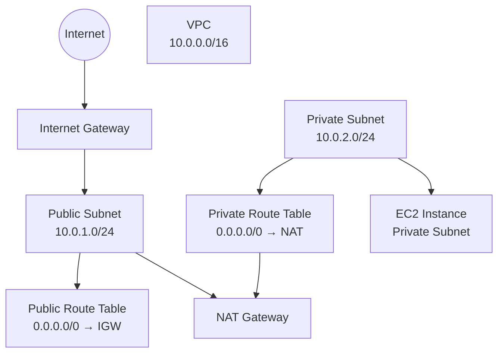

# AWS Terraform Project 2 – Private EC2 with NAT Gateway

## 📌 Project Overview

This project demonstrates how to deploy a **secure AWS network architecture using Terraform** where an **EC2 instance runs inside a private subnet** without a public IP address.

The instance cannot be accessed directly from the internet but is still able to **access the internet for updates and package installations using a NAT Gateway**.

This project introduces **multi-subnet VPC design**, which is a common architecture used in **production cloud environments**.

This is the **second project in the AWS Terraform learning roadmap**.

---

# 🎯 Objectives

By completing this project you will learn how to:

- Design a **multi-subnet VPC architecture**
- Create **public and private subnets**
- Configure **NAT Gateway for outbound internet access**
- Configure **separate route tables**
- Deploy **EC2 in a private subnet**
- Implement **secure network isolation**
- Reuse Terraform **modules from Project 1**

---

# 🧰 Technologies Used

- Terraform
- AWS
- Amazon EC2
- AWS VPC Networking
- NAT Gateway
- Infrastructure as Code (IaC)

---

# 📋 Infrastructure Components

This project provisions the following AWS resources:

| Resource         | Description                                      |
| ---------------- | ------------------------------------------------ |
| VPC              | Custom Virtual Private Cloud                     |
| Public Subnet    | Hosts the NAT Gateway                            |
| Private Subnet   | Hosts the EC2 instance                           |
| Internet Gateway | Allows internet connectivity                     |
| NAT Gateway      | Provides internet access to private subnet       |
| Route Tables     | Separate routing for public and private networks |
| Security Group   | Controls instance access                         |
| EC2 Instance     | Private compute server                           |

---

# 🏗 Architecture Diagram



---

# 🌐 Network Design

| Component      | CIDR        |
| -------------- | ----------- |
| VPC            | 10.0.0.0/16 |
| Public Subnet  | 10.0.1.0/24 |
| Private Subnet | 10.0.2.0/24 |

---

# 🔁 Traffic Flow

### Outbound Internet Access from Private EC2

```
Private EC2
     │
Private Route Table
     │
NAT Gateway
     │
Internet Gateway
     │
Internet
```

This allows the instance to:

- Install packages
- Download updates
- Access external APIs

while **remaining private and secure**.

---

# 📁 Expected Project Structure

The project should follow a **modular Terraform structure** similar to Project 1.

```
project-2-private-ec2-nat/
├── backend.tf
├── main.tf
├── provider.tf
├── variables.tf
├── outputs.tf
│
├── modules
│
│   ├── vpc
│   │   ├── main.tf
│   │   ├── variables.tf
│   │   └── outputs.tf
│
│   ├── sg
│   │   ├── main.tf
│   │   ├── variables.tf
│   │   └── outputs.tf
│
│   └── ec2
│       ├── main.tf
│       ├── variables.tf
│       └── outputs.tf
│
└── README.md
```

---

# 📦 Module Responsibilities

### VPC Module

Responsible for networking infrastructure.

Resources should include:

- VPC
- Public Subnet
- Private Subnet
- Internet Gateway
- NAT Gateway
- Public Route Table
- Private Route Table
- Route Table Associations

---

### Security Group Module

Responsible for instance security.

Example rules:

- Allow SSH from trusted sources
- Allow outbound traffic

---

### EC2 Module

Responsible for compute resources.

Requirements:

- Deploy EC2 in **private subnet**
- **No public IP address**
- Attach security group

---

# ⚠ Important Requirements

The private EC2 instance must:

- **NOT have a public IP**
- Use the **private subnet**
- Access the internet **through the NAT Gateway**

Example Terraform configuration:

```hcl
associate_public_ip_address = false
```

---

# ⚙ Prerequisites

Before running this project ensure:

- AWS Account
- AWS CLI configured
- Terraform installed
- SSH key pair created

Verify installation:

```bash
terraform -version
aws --version
```

---

# 🚀 Deployment Steps

### Initialize Terraform

```bash
terraform init
```

---

### Review the execution plan

```bash
terraform plan
```

---

### Deploy infrastructure

```bash
terraform apply
```

Confirm with:

```
yes
```

---

# 🧪 Testing the Setup

To verify NAT Gateway functionality:

1. Connect to the EC2 instance using a bastion host or temporary public instance.
2. Run:

```bash
sudo yum update -y
```

or

```bash
curl https://google.com
```

If successful, the **private instance has internet access via NAT**.

---

# 📚 Concepts Learned

After completing this project you should understand:

- Public vs Private Subnets
- NAT Gateway architecture
- Route table separation
- Secure network design
- Private compute infrastructure
- Modular Terraform reuse

---

# 🔜 Next Project

The next project will introduce **high availability infrastructure**.

## Project 3 – Application Load Balancer with Multiple EC2 Instances

You will learn:

- Application Load Balancer (ALB)
- Target Groups
- Multi-instance architecture
- High availability deployment
- Auto Scaling Groups

---

# 👨‍💻 Author

Terraform AWS Learning Series
