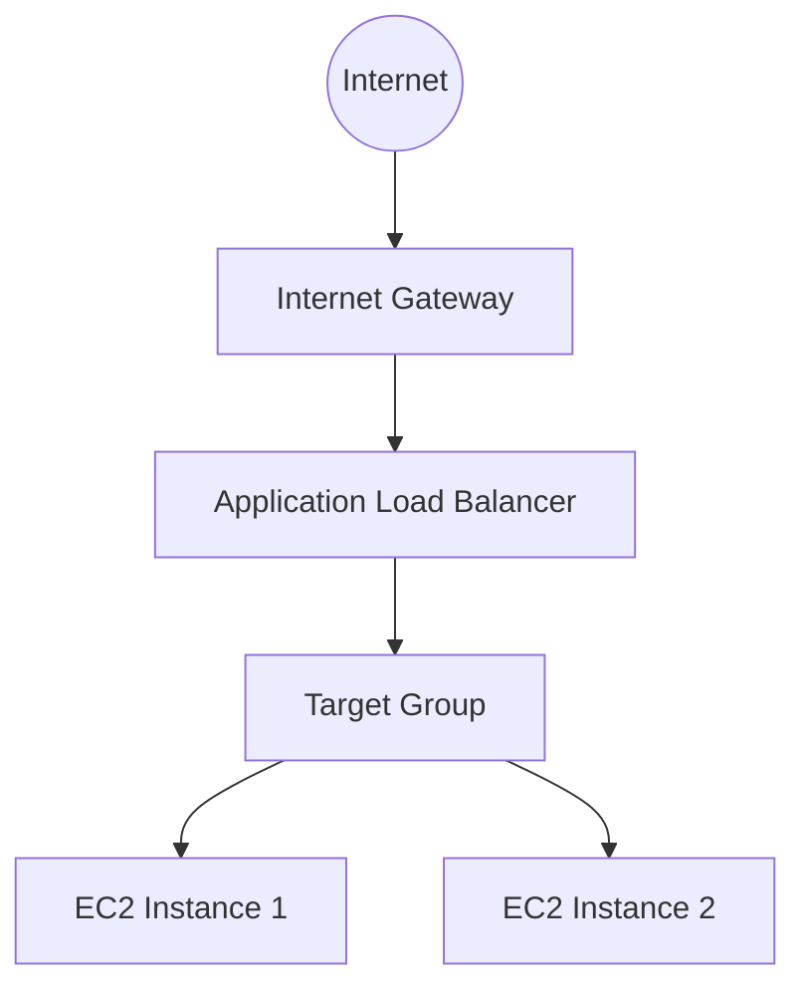

# 🏗 Architecture Diagram



# 🧱 Network Layout

| Component     | Location        |
| ------------- | --------------- |
| ALB           | Public Subnets  |
| EC2 Instances | Private Subnets |
| NAT Gateway   | Public Subnet   |

#📦 Infrastructure Components

| Resource         | Purpose                 |
| ---------------- | ----------------------- |
| VPC              | Network container       |
| Public Subnets   | ALB                     |
| Private Subnets  | EC2 instances           |
| Internet Gateway | Internet access         |
| NAT Gateway      | Private subnet internet |
| ALB              | Load balancing          |
| Target Group     | Register EC2            |
| EC2 Instances    | Web servers             |
| Security Groups  | Control traffic         |

# 🌐 Traffic Flow

```

User Browser
     │
     ▼
Application Load Balancer
     │
     ▼
Target Group
     │
 ┌─────────────┐
 ▼             ▼
EC2 #1       EC2 #2

```

# Web Server Setup

Each EC2 will install Nginx automatically using user_data.

```bash
#!/bin/bash
yum update -y
yum install nginx -y
systemctl start nginx
systemctl enable nginx

```
