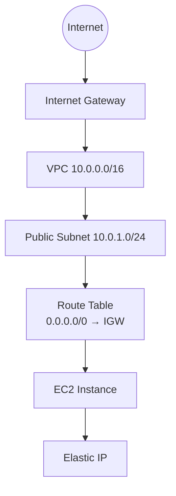

# AWS Terraform Project 1 – EC2 in Public Subnet

## 📌 Project Overview

This project demonstrates how to deploy a **basic AWS infrastructure using Terraform**.  
The infrastructure includes a **Virtual Private Cloud (VPC)**, a **Public Subnet**, and an **EC2 instance** that is accessible from the internet.

The goal of this project is to understand how Terraform provisions AWS networking resources and compute services together.

This is the **first project in the Terraform AWS learning roadmap**.

---

# 🎯 Objectives

By completing this project you will learn:

- Creating AWS infrastructure using Terraform
- Building a custom **VPC**
- Creating and attaching an **Internet Gateway**
- Creating a **Public Subnet**
- Configuring **Route Tables**
- Creating **Security Groups**
- Launching an **EC2 instance**
- Associating an **Elastic IP**
- Using **Terraform outputs**

---

# 🧰 Technologies Used

- Terraform
- AWS
- EC2
- VPC Networking

---

# 📋 Infrastructure Components

This project provisions the following AWS resources:

| Resource         | Description                     |
| ---------------- | ------------------------------- |
| VPC              | Custom Virtual Private Cloud    |
| Public Subnet    | Subnet accessible from internet |
| Internet Gateway | Enables internet access         |
| Route Table      | Routes internet traffic         |
| Security Group   | Allows SSH access               |
| EC2 Instance     | Compute instance                |
| Elastic IP       | Static public IP for EC2        |

---

# 🏗 Architecture Diagram



---

# 📁 Project Structure

```
project-1-ec2-public/
├── backend.tf
├── main.tf
├── modules
│   ├── ec2
│   │   ├── main.tf
│   │   ├── outputs.tf
│   │   └── variables.tf
│   ├── sg
│   │   ├── main.tf
│   │   ├── outputs.tf
│   │   └── variable.tf
│   └── vpc
│       ├── main.tf
│       ├── outputs.tf
│       └── variables.tf
├── outputs.tf
├── provider.tf
├── README.md
└── variables.tf
```

---

# ⚙ Prerequisites

Before running this project make sure you have:

- AWS Account
- AWS CLI configured
- Terraform installed
- SSH key pair created in AWS

Check versions:

```bash
terraform -version
aws --version
```

---

# 🚀 How to Deploy

### 1️⃣ Clone Repository

```bash
git clone <repo-url>
cd project-1-ec2-public
```

---

### 2️⃣ Initialize Terraform

```bash
terraform init
```

---

### 3️⃣ Review Execution Plan

```bash
terraform plan
```

---

### 4️⃣ Apply Infrastructure

```bash
terraform apply
```

Type:

```
yes
```

Terraform will create all AWS resources.

---

# 📤 Terraform Output

After deployment Terraform will output:

```
ec2_public_ip = x.x.x.x
```

---

# 🔐 Connect to EC2

Use SSH:

```bash
ssh -i your-key.pem ec2-user@EC2_PUBLIC_IP
```

---

# 🧹 Destroy Infrastructure

To avoid AWS charges, destroy resources after testing:

```bash
terraform destroy
```

---

# 📚 What You Learned

After completing this project you should understand:

- Terraform resource creation
- AWS networking basics
- VPC architecture
- Internet connectivity using IGW
- Security groups and SSH access
- Terraform outputs

---

# 🔜 Next Project

The next project will be:

**Private EC2 Instance with NAT Gateway**

You will learn:

- Private subnets
- NAT Gateway
- Secure backend servers
- Internet access without public IP

---

# 👨‍💻 Author

Terraform AWS Learning Series

# 1. SSH Connect

```
-- Connect to public EC2 instance
sh -i test.pem ec2-user@<public-instance-ip>

-- Connect to private instance via public instance (Bastion)
sh -i test.pem -J ec2-user@1<public-instance-ip> ec2-user@<private-instance-ip>

```

# 2. SSH Connect

```bash
scp -i test.pem test.pem ec2-user@<public-instance-ip>:/home/ec2-user/

sh -i test.pem ec2-user@<public-instance-ip>

sh -i test.pem ec2-user@<private-instance-ip>

```
